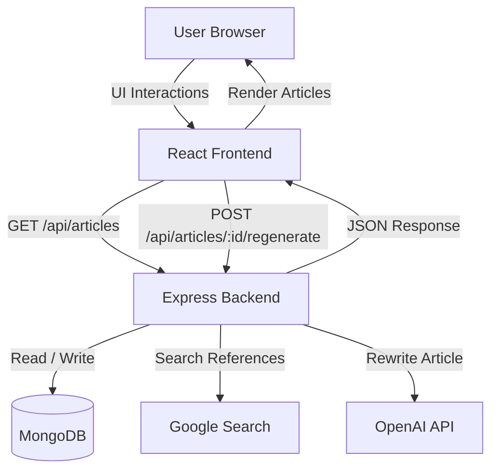

# BeyondChats Assignment – Full Stack Application

This project is a full-stack application built as part of the BeyondChats internship assignment.  
It scrapes articles, regenerates them using an LLM with reference material, and displays them in a simple frontend UI.

---

## Tech Stack

### Backend
- Node.js
- Express
- MongoDB (Mongoose)
- Axios & Cheerio (web scraping)
- OpenAI API (article rewriting)

### Frontend
- React
- Vite
- CSS (no external UI framework)

---

## Features

- REST APIs for article CRUD operations
- Scraping oldest BeyondChats blog articles
- Google search integration for reference articles
- Article rewriting using LLM with references
- Frontend to list, view, and regenerate articles
- Loading-safe regeneration flow
- Clean, incremental commit history

---

## Project Structure

    beyondchats-assignment/
    ├── backend/
    │ ├── src/
    │ │ ├── controllers/
    │ │ ├── models/
    │ │ ├── routes/
    │ │ ├── services/
    │ │ ├── scripts/
    │ │ └── config/
    │ └── package.json
    │
    ├── frontend/
    │ ├── src/
    │ │ ├── components/
    │ │ ├── pages/
    │ │ ├── services/
    │ │ └── styles/
    │ └── package.json
    │
    └── README.md


---

## Architecture & Data Flow

The application follows a simple client–server architecture.  
A React frontend communicates with a Node.js (Express) backend via REST APIs.  
The backend handles scraping, article regeneration, persistence, and external integrations.


## Framework Clarification

Although the assignment mentioned Laravel, this project is intentionally implemented using Node.js with Express.

The choice was made to:
- Maintain consistency across frontend and backend using JavaScript
- Simplify API development and async workflows
- Focus on system design, data flow, and feature completeness rather than framework-specific boilerplate

All required backend functionality is fully implemented and documented.

## Live Deployment & API Configuration
**Frontend**

    - Deployed on Vercel

    - Production URL : https://beyondchat-assignment-frontend.vercel.app

The frontend communicates with the backend using a configurable API base URL.

**Backend**

    - Deployed on Render

    - Runs a Node.js (Express) server on port 5000

    - Exposes REST APIs under /api/*

Note: The backend is hosted on Render’s free tier.
The first request after inactivity may take up to ~50 seconds due to cold start.

**Database**

    - MongoDB Atlas (cloud-hosted)

    - Connected via Mongoose

    - Used for persisting scraped and regenerated articles

## Environment Configuration

### Frontend Environment Variables

```env
# Generic
VITE_API_BASE_URL=<BACKEND_DEPLOYMENT_URL>

# Local development
VITE_API_BASE_URL=http://localhost:5000/api

# Production
VITE_API_BASE_URL=<Render backend URL>

## Local Setup
**Backend**
    cd backend
    npm install
    npm run dev


Backend runs on: 
    http://localhost:5000

**Frontend**
    cd frontend
    npm install
    npm run dev

Frontend runs on:
    http://localhost:5173

## Limitations
- Google scraping may be rate-limited or blocked.
- Render free-tier cold starts can delay first response.
- LLM output quality depends on external reference availability.
